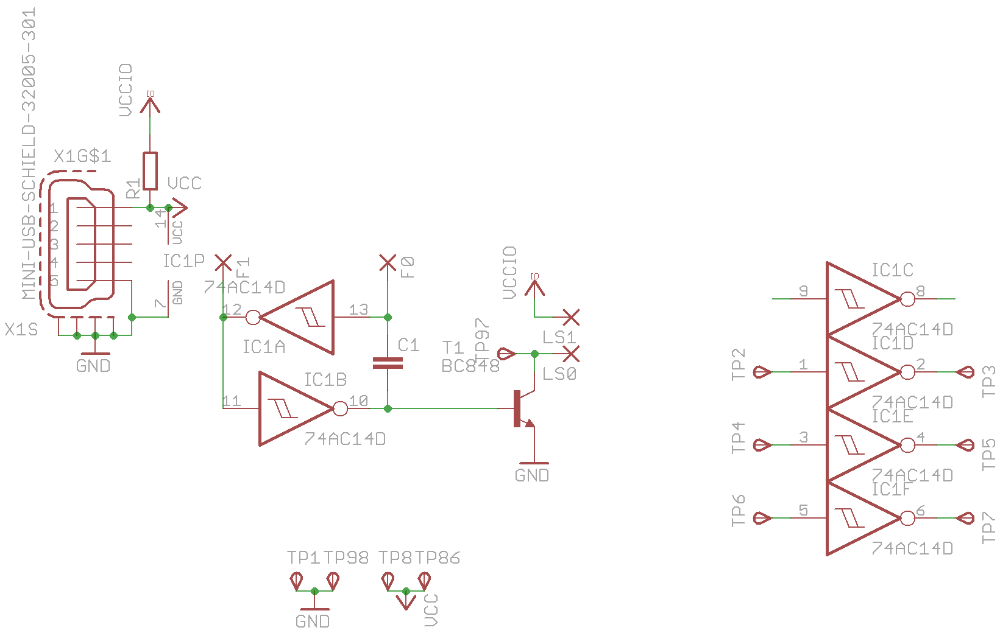
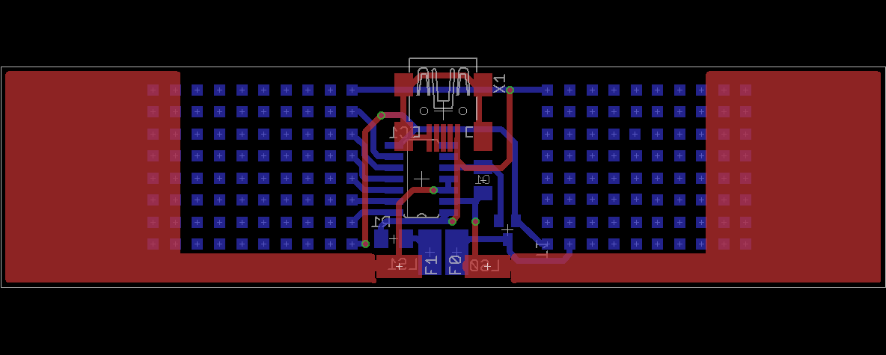

### What?
Well, we wanted some kit for the next CCC events like the 30C3. I had no
real idea for something new and there was this piece of art, called
*werdeteildesgesamtwiderstand* which produces a tone based on how much you
are pressing on two pads.

The circuit is very simple and it makes noise. So it's perfect for people
who make their first experiences with soldering because there are not a lot
of parts, you get an instant feedback and there are pads on the backside so
you can modify it on your own!

Also it should be easy to supply it and targeting some nerds there was only
one simple solution: USB. And because there are additional pads for VCC and
GND you can also solder some 9V battery connector there.

### Images
#### Circuit

#### Board

